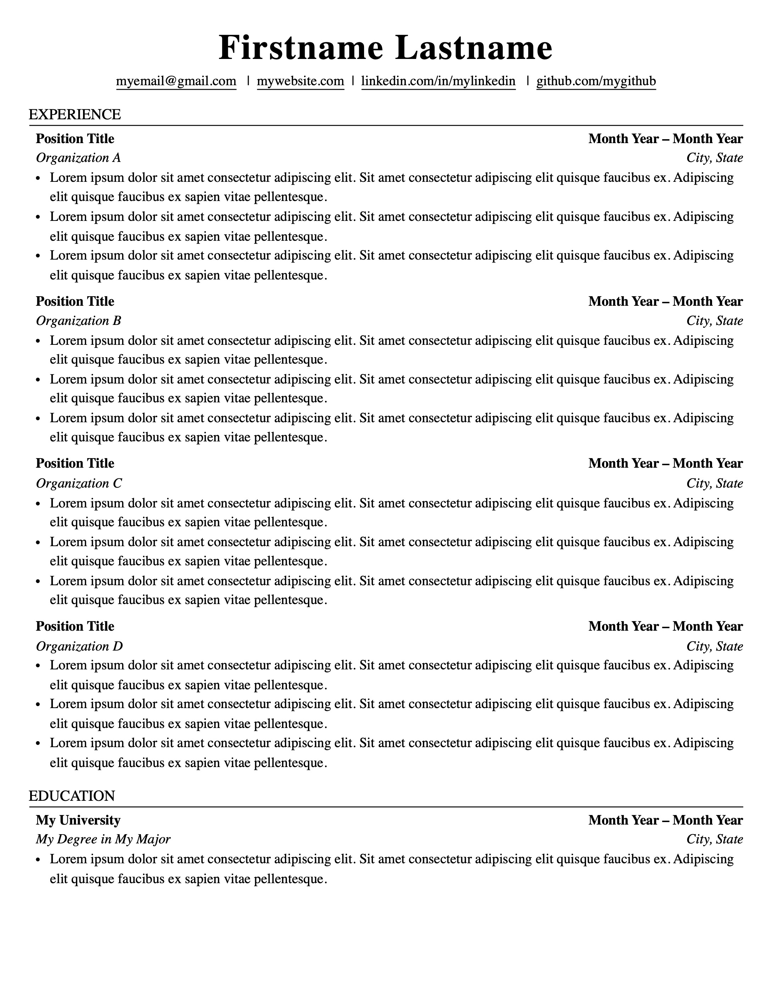
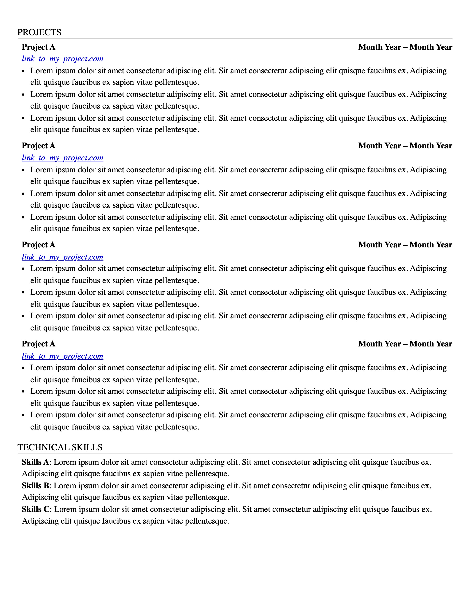

# 📄 AI-Optimized Resume Template

A clean, professional resume template built with HTML/CSS that's designed to be **parsed by AI systems** while looking great for human readers.

## ✨ Why This Template?

- 🤖 **ATS-Friendly**: Optimized for Applicant Tracking Systems and AI resume parsers
- 🎨 **Professional Design**: Clean, modern layout that stands out
- 🔧 **Fully Customizable**: Easy-to-edit HTML/CSS with CSS variables for quick styling changes
- 📱 **Print-Perfect**: Generates pixel-perfect PDFs ready for submission
- 🚀 **No Dependencies**: Pure HTML/CSS - no complex build tools required

## 🖼️ Preview




## 🚀 Quick Start

### 1️⃣ Installation

```bash
# Create and activate virtual environment
python3 -m venv venv
source venv/bin/activate

# Install dependencies
pip install -r requirements.txt
playwright install
```

### 2️⃣ Customize Your Resume

Edit [`resume_template.html`](resume_template.html) with your information, or create your own HTML file following the template structure.

**Pro Tip**: Adjust colors, fonts, and spacing in [`resume_template.css`](resume_template.css) using the CSS variables at the top of the file!

### 3️⃣ Generate PDF

There is a simple Python script to convert your HTML resume to a PDF using Playwright. Alternatively, you can use open your resume HTML file in a browser and print to PDF using `ctrl + p`. The script method is included for convenience and to ensure consistent results.
```bash
python3 to_pdf.py <input_html_path> <output_pdf_path>
```

**Example:**
```bash
python3 to_pdf.py my_resume.html my_resume.pdf
```

## 🎨 Customization

All styling can be easily customized through CSS variables in [`resume_template.css`](resume_template.css):

```css
:root {
    --primary-color: #000000;
    --link-color: #0000EE;
    --font-size-base: 11pt;
    --font-size-name: 28pt;
    /* ... and many more! */
}
```

## 📋 Features

- ✅ Multi-page support with consistent styling
- ✅ Semantic HTML structure for better parsing
- ✅ Responsive contact information layout
- ✅ Organized sections: Experience, Education, Projects, Skills
- ✅ Professional typography with proper spacing
- ✅ Print-optimized layout

## 📄 License

This project is licensed under the MIT License. See the [LICENSE](LICENSE) file for details.